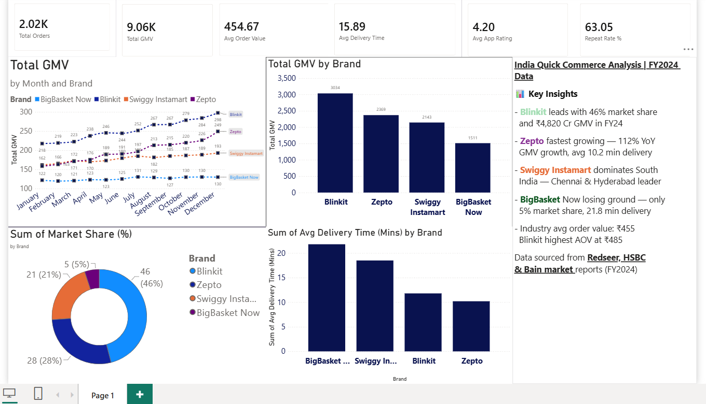

# quickcommerce-india-dashboard
India Quick Commerce Market Intelligence Dashboard — Blinkit vs Zepto vs Swiggy Instamart vs BigBasket Now | Power BI | FY2024

# 🛒 India Quick Commerce Market Intelligence Dashboard | FY2024

A competitive intelligence dashboard analysing the Indian Quick Commerce market — 
Blinkit vs Zepto vs Swiggy Instamart vs BigBasket Now — built in Power BI using 
data sourced from Redseer, HSBC, and Bain market reports (FY2024).

---

## 📊 Dashboard Preview

---

## 🔍 What This Dashboard Covers

- **Market Share Analysis** — Blinkit 46% | Zepto 28% | Swiggy Instamart 21% | BigBasket Now 5%
- **GMV Trend** — Monthly GMV tracking across all 4 brands for Jan–Dec 2024
- **Brand Benchmarking** — Total GMV, Avg Order Value, Delivery Time, App Rating, Repeat Rate
- **City Penetration** — 8 cities across Tier 1 and Tier 2 markets
- **Key Insights Panel** — Business narrative highlighting market dynamics and competitive positioning

---

## 📁 Dataset

| Sheet | Description |
|---|---|
| Monthly Performance | 384 rows — GMV, Orders, AOV, Delivery Time, Ratings by Brand × City × Month |
| Category Performance | 40 rows — Market share, basket size, YoY growth by category |
| Brand Scorecard | High-level KPIs — GMV, dark stores, valuation, funding, profitability |
| City Penetration | Dark store count, coverage %, MAU, orders per user by city |

Data is based on publicly available market reports (Redseer, HSBC, Bain — FY2024).

---

## 🛠 Tools Used

- **Power BI Desktop** — Dashboard, DAX measures, interactive visuals
- **Excel** — Data structuring and preparation
- **DAX** — Custom measures: Total GMV, MoM GMV Growth %, Avg Delivery Time, Avg Order Value, Avg App Rating, Repeat Rate %, Total Orders

---

## 📈 Key Insights

- Blinkit leads with ₹4,820 Cr GMV and 46% market share in FY2024
- Zepto is the fastest growing player — 112% YoY GMV growth, avg 10.2 min delivery
- Swiggy Instamart dominates South India — market leader in Chennai and Hyderabad
- BigBasket Now losing ground — only 5% market share with 21.8 min avg delivery
- Industry avg order value: ₹455 | Blinkit highest AOV at ₹485

---

## 📂 Files in this Repo

| File | Description |
|---|---|
| [`quickcommercedbb.pbix`](quickcommercedbb.pbix) | Power BI dashboard file — download and open in Power BI Desktop to interact |
| [`QuickCommerce_India_Dashboard_Data.xlsx`](QuickCommerce_India_Dashboard_Data.xlsx) | Raw dataset — 4 sheets |
| [`dashboard_preview.png`](dashboard_preview.png) | Dashboard screenshot |

---

## 👤 Author

**Ayaan Ansari**  
BMS (Core Marketing) — University of Mumbai  
📧 okciciayaan@gmail.com  
🔗 [LinkedIn](https://linkedin.com/in/ayaan-ansari)  
🐙 [GitHub](https://github.com/aynn11)
